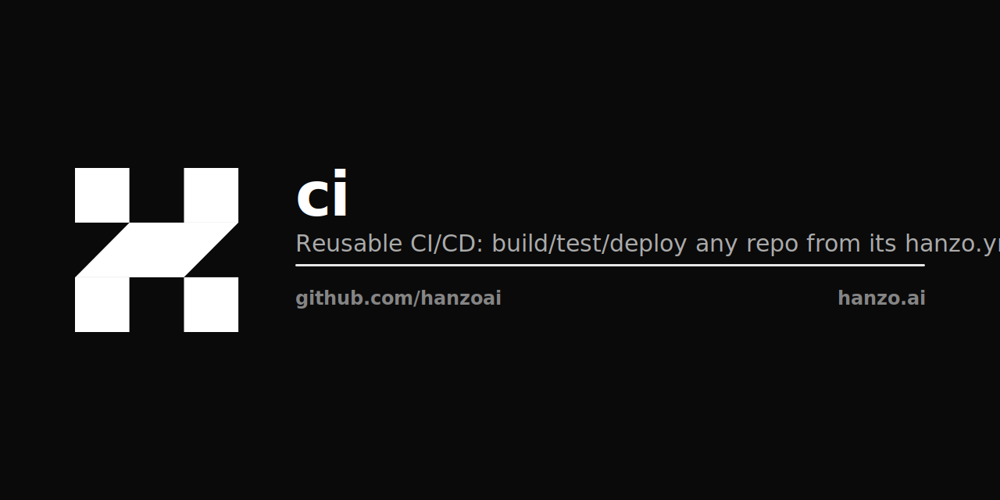

<p align="center"></p>

# hanzoai/ci

One reusable CI/CD workflow for every Hanzo / Lux / Zoo repo. Build + test +
deploy, driven entirely by the repo's root **`hanzo.yml`**. No per-repo build
logic — repos import this and declare their specifics in `hanzo.yml`.

## Use it

A repo needs two files. First, `hanzo.yml` at the root (the config):

```yaml
images:
  - { name: api, context: ./api, repo: ghcr.io/<org>/<repo>, tag-suffix: api }
test:
  - { name: api, run: "pytest -q" }
deploy:
  cluster: <cluster>
  namespace: <ns>
  on: [main]
  services:
    - { name: <deployment>, image: api }
kms: { path: /deploy, environment: prod }
```

Second, a ~7-line `.github/workflows/cicd.yml` that just imports this:

```yaml
name: CI/CD
on:
  push: { branches: [main], tags: ["v*"] }
  pull_request:
  workflow_dispatch:
jobs:
  cicd:
    uses: hanzoai/ci/.github/workflows/build.yml@v1
    secrets: inherit
```

That's it. The build/test/deploy logic lives here, once.

## Runners — our cloud or your own

By default the build runs on the **Hanzo cloud** arc pool (we run it; metered as
build minutes). To run on **your own** self-hosted arc runners, pass their labels:

```yaml
    uses: hanzoai/ci/.github/workflows/build.yml@v1
    with:
      runner: '["self-hosted","my-pool","linux","amd64"]'
    secrets: inherit
```

## Delegate to platform (skip runner buildx)

By default the build runs buildx **on** the arc runner. To instead hand the build
to **platform.hanzo.ai** — which builds in-cluster with BuildKit and rolls the
service itself — pass `mode: delegate`:

```yaml
    uses: hanzoai/ci/.github/workflows/build.yml@v1
    with:
      mode: delegate
    secrets: inherit
```

The GitHub job then just POSTs each image in `hanzo.yml` to platform's direct
build webhook (`/v1/arcd/enqueue`) and exits in **seconds** — no runner buildx,
no KMS, no runner-side deploy. Platform creates the build job, launches an
in-cluster BuildKit Job on its own pool, pushes to the registry, and patches the
operator `Service` CR to roll it. It's the same build path as the platform
GitHub-App webhook — one build path, two front doors.

Requires one extra secret, `PLATFORM_BUILD_CALLBACK_TOKEN` (org- or repo-level,
picked up via `secrets: inherit`). Override the endpoint with the
`PLATFORM_ENQUEUE_URL` repo/org variable (default `https://platform.hanzo.ai/v1/arcd/enqueue`).

`mode: buildx` (the default) is unchanged — existing repos keep running buildx on
arc, so delegation is strictly opt-in.

## Credentials

The only GitHub secrets a repo sets are `KMS_CLIENT_ID` / `KMS_CLIENT_SECRET`
(plus the `KMS_WORKSPACE` repo variable). Everything else — the GHCR push token,
the cluster kubeconfig — is pulled from KMS (`kms.hanzo.ai`, Universal Auth) at
run time. No long-lived registry or cluster credentials live in GitHub.

## Platform-native

`hanzo.yml` is also read by platform.hanzo.ai: a repo on the platform webhook
needs **only** `hanzo.yml` — the platform builds it on arc and rolls it out, no
workflow file at all. This reusable is the GitHub-Actions path for repos that
trigger through GitHub instead of the platform.
