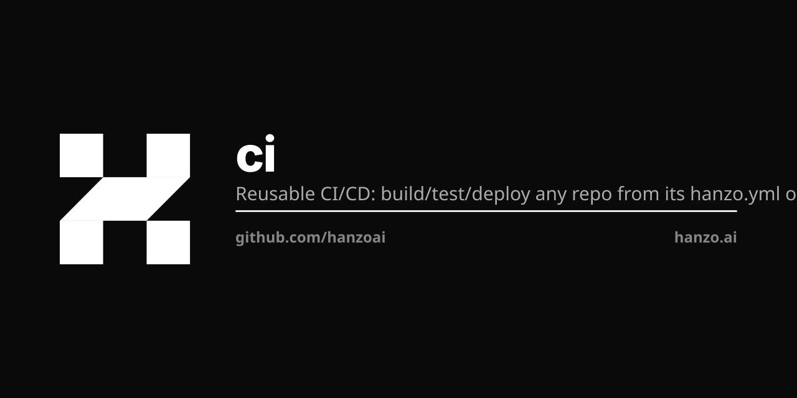

<p align="center"></p>

# hanzoai/ci

One reusable CI/CD workflow for every Hanzo / Lux / Zoo repo. Build + test +
deploy, driven entirely by the repo's root **`hanzo.yml`**. No per-repo build
logic — repos import this and declare their specifics in `hanzo.yml`.

## Use it

A repo needs two files. First, `hanzo.yml` at the root (the config):

```yaml
images:
  - { name: api, context: ./api, repo: ghcr.io/<org>/<repo>, tag-suffix: api }
test:
  - { name: api, run: "pytest -q" }
deploy:
  cluster: <cluster>
  namespace: <ns>
  on: [main]
  services:
    - { name: <deployment>, image: api }
kms: { path: /deploy, environment: prod }
```

Second, a ~7-line `.github/workflows/cicd.yml` that just imports this:

```yaml
name: CI/CD
on:
  push: { branches: [main], tags: ["v*"] }
  pull_request:
  workflow_dispatch:
jobs:
  cicd:
    uses: hanzoai/ci/.github/workflows/build.yml@v1
    secrets: inherit
```

That's it. The build/test/deploy logic lives here, once.

## `client:` — one document, eight generated clients

A generated SDK is a **projection** of one API document at one version. This lane
is the only place in the fleet that says how a projection is made, so the eight
client repos (`python-sdk`, `js-sdk`, `go-sdk`, `rust-sdk`, `java-sdk`,
`kotlin-sdk`, `cpp-sdk`, `cli`) stop carrying eight copies of the same eight
lines.

```yaml
client:
  spec: { repo: hanzoai/cloud, path: openapi.yaml }   # these are the defaults
  generate: ./scripts/generate.sh        # $SPEC is the fetched document
  version:  'package.json:jq -r .version package.json'   # optional; see below
```

There is deliberately **no `build:`**. The repo already declared how it proves
itself, in `test:`, and that block runs over the regenerated tree — which is
exactly the gate. A second declaration would be one assertion written twice.

It fires on `repository_dispatch: spec-update`, which **hanzoai/cloud sends once
per release**:

```yaml
on:
  repository_dispatch: { types: [spec-update] }
  workflow_dispatch:
```

The coupler is the document, **passed by value at a pinned ref**. The payload
carries `(version, sha, spec_sha256)`; the lane fetches `openapi.yaml` at that
sha and refuses if the bytes hash to anything else — every projection of one
release is generated from one digest. Reading a live host instead would be a lie
about which deploy the client describes.

Three gates, in order:

| gate | refuses |
|---|---|
| digest | a client generated from a different document than its siblings |
| `test:` | a spec change that produces a client which does not compile — **including its examples** |
| `.spec-lock` | is committed beside the code: `ref` + `sha256`, so anyone can ask a client repo *which document are you?* without running a generator |

On a delta — and only after `test:` has passed over exactly those bytes — the
lane commits the projection, bumps the **patch** (derived, never typed: a
projection never earns a minor or a major) and pushes the tag. The repo's own tag
lane publishes it, so the registry credential stays where the publish is.

`version:` is optional. A Go module's version *is* its tag, so with no `version:`
the current one is read from the tags themselves and nothing is rewritten —
inventing a VERSION file for those repos would be a second place a version could
be wrong.

Credential: **`SPEC_TOKEN`** — a fine-grained token with `contents:read` on the
spec repo.

## `binaries:` — publish a plugin once, install it everywhere

`images:` ships an OCI image a **cluster** runs. `binaries:` ships an
executable a **running host** installs: a [zip](https://github.com/zap-proto/zip)
plugin, fetched at run time by URL and verified against its SHA-256 before it is
ever made executable. Build it once per OS/arch here; every host picks up the
same bits, and nobody rebuilds the world to ship a plugin.

```yaml
binaries:
  - name: billing
    main: ./cmd/billing              # the Go package; default "."
    platforms: [linux/amd64, linux/arm64]   # default [linux/amd64]
    ldflags: "-s -w"                 # default
```

`main:` is the zero-config **Go** lane. Every other toolchain uses the same block
with `run:` (the command that builds) and `out:` (the glob of what it produced) —
which is how a repo with no Dockerfile and no Go still publishes an artifact:

```yaml
binaries:
  - name: sdk
    run: npm install && npm run build && npm pack --pack-destination .
    out: "*.tgz"
    image: node:22-bookworm          # the toolchain — see below
```

`image:` names the container the **platform** lane runs `run:` in
(`POST /v1/runner`, one initContainer per entry, in-cluster). Here the toolchain
IS the runner, so this workflow reads past it. It is not a second recipe: both
lanes read the same `binaries:` block out of the same `hanzo.yml` and publish the
same `binaries.json` at the same URL.

Artifacts land under `<name>` in the index regardless of lane; a `run:` entry is
`os: any, arch: any`, because an npm tarball or a wheel is not per-platform and
an index entry that claimed one would be a lie a host acts on.

Built on every push (an arm64 cross-compile that breaks fails the PR that broke
it) and **published on a tag**, after the `test:` gate — a host installs an
artifact unattended, so the tests gate the bits. Each artifact lands on the
GitHub Release for that tag:

```
https://github.com/<owner>/<repo>/releases/download/<tag>/<name>-<os>-<arch>
```

plus `binaries.json` beside them — `{name, os, arch, url, sha256}` for every
artifact, so the bits and the digest that authorizes them ship as one release
and a host reads both from one place. The job summary prints the
`zip.Load(zip.Plugin{URL, Sum})` a host pastes.

Add a top-level `bucket:` and they publish to **hanzoai/s3** instead — same
artifacts, same index, only the url changes:

```yaml
bucket: plugins   # → https://s3.hanzo.ai/plugins/<owner>/<repo>/<tag>/binaries.json
```

Credentials are the `S3_ADMIN_*` names the services already read, pulled from
KMS at run time; a declared bucket with no credential fails the publish rather
than shipping an index whose artifacts are missing. Use it for anything large or
frequent — a GitHub release stores it on a quota we do not own.

Builds are `CGO_ENABLED=0 -trimpath`: the host that installs this runs it on
whatever base image the host is, and the digest must be a function of the
source, not of the checkout path.

## Runners — our cloud or your own

By default the build runs on the **Hanzo cloud** arc pool (we run it; metered as
build minutes). To run on **your own** self-hosted arc runners, pass their labels:

```yaml
    uses: hanzoai/ci/.github/workflows/build.yml@v1
    with:
      runner: '["self-hosted","my-pool","linux","amd64"]'
    secrets: inherit
```

## Delegate to platform (skip runner buildx)

By default the build runs buildx **on** the arc runner. To instead hand the build
to **platform.hanzo.ai** — which builds in-cluster with BuildKit and rolls the
service itself — pass `mode: delegate`:

```yaml
    uses: hanzoai/ci/.github/workflows/build.yml@v1
    with:
      mode: delegate
    secrets: inherit
```

The GitHub job then just POSTs each image in `hanzo.yml` to platform's direct
build webhook (`/v1/arcd/enqueue`) and exits in **seconds** — no runner buildx,
no KMS, no runner-side deploy. Platform creates the build job, launches an
in-cluster BuildKit Job on its own pool, pushes to the registry, and patches the
operator `Service` CR to roll it. It's the same build path as the platform
GitHub-App webhook — one build path, two front doors.

Requires one extra secret, `PLATFORM_BUILD_CALLBACK_TOKEN` (org- or repo-level,
picked up via `secrets: inherit`). Override the endpoint with the
`PLATFORM_ENQUEUE_URL` repo/org variable (default `https://platform.hanzo.ai/v1/arcd/enqueue`).

`mode: buildx` (the default) is unchanged — existing repos keep running buildx on
arc, so delegation is strictly opt-in.

## Credentials

The only GitHub secrets a repo sets are `KMS_CLIENT_ID` / `KMS_CLIENT_SECRET`
(plus the `KMS_WORKSPACE` repo variable). Everything else — the GHCR push token,
the cluster kubeconfig — is pulled from KMS (`kms.hanzo.ai`, Universal Auth) at
run time. No long-lived registry or cluster credentials live in GitHub.

## Platform-native

`hanzo.yml` is also read by platform.hanzo.ai: a repo on the platform webhook
needs **only** `hanzo.yml` — the platform builds it on arc and rolls it out, no
workflow file at all. This reusable is the GitHub-Actions path for repos that
trigger through GitHub instead of the platform.
